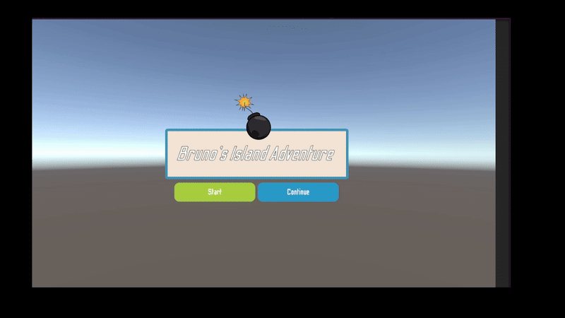

# 🎮 RPG Playground

*A personal project for exploring and prototyping RPG mechanics in Unity.*

---

## 🕹️ About the Project
This is a personal learning project built to experiment with RPG game systems such as dialogue, quests, combat AI, and cinematics.

> ⚠️ **Note:** The game is still in development and does not yet include standalone builds. Some features and areas may be incomplete.

---

## 🚀 How to Run

1. Clone this repository: 
   git clone 
   Open the project in Unity 2022.x or newer

2. Load the Island Scene located in Assets/Scenes/

3. Press Play in the Unity Editor

## ✨ Features
### 🧭 Basic UI

- Main menu and quest dialogue box

- Player health and potion display

- Enemy health bars

### 💬 Dialogue & Quest System

- Built using Ink and a state machine to track quest progress

- NPCs initiate quests and provide branching dialogue choices

- Rewards are given for completing NPC objectives

### ⚔️ Enemy AI (NavMesh)

- Enemies chase and attack the player using Unity’s NavMesh

- Two AI types: Patrolling and Stationary

- AI behavior controlled via a state machine (idle, patrol, attack, death)

### 🎥 Cinematics

- Short in-game cinematics created with Cinemachine and camera dolly tracks

### 🗡️ Combat

- Simple Space Bar click combat that can hit multiple enemies.

### 🕺 Character Animations

- Player and NPCs feature walk, run, attack, and death animations

- All managed via the Animator Controller

### 🧭 Future Plans / Roadmap

- 🎧 Add sound effects

- 🏝️ Improve and polish island & dungeon maps for atmosphere

- 🌊 Create custom shaders for water and reflections

- 💥 Design VFX for combat

### 💾 Player Saving

Implements persistent player progress using PlayerPrefs

Saves items, health, and completed quests

Automatically restores saved data when the game is reopened

### 🙌 Credits

Developed as part of the ZeroToMasters Unity Bootcamp course — huge thanks to the instructors!

Free assets used:

KayKit Free Assets
Kenney Nature Kit
